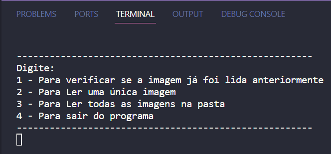
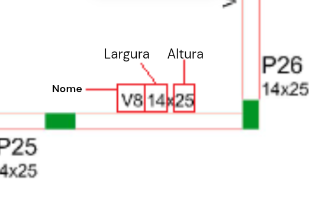
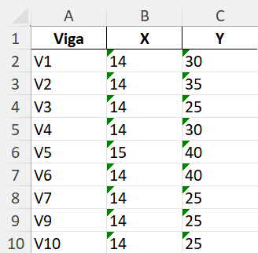

## Resumo do projeto
O projeto foi feito com o intuíto de realizar a leitura de dados de vigas através de imagens, e gerar arquivos xslx para armazenar e organizar esses dados, o que era um trabalho manual, que com esse programa se tornou automatizado, somente colocando as imagens desse tipo de planta seguindo o padrão de nome, o software realiza a organização em pastas e gera os documentos excel.

## Tabela de conteúdos
   * [Funcionalidades](#funcionalidades)
   * [Tecnologias utilizadas](#tecnologias-utilizadas)
   * [Requisitos para uso](#requisitos-para-uso)
   * [Instalação](#instalacao)
   * [Execução](#execucao)
   * [Funcionamento do projeto](#funcionamento-do-projeto)
   * [Conclusão](#conclusao)

## Funcionalidades
- 1 - Verificar se alguma das imagens no diretório raiz já foram lidas em algum outro momento, baseado no nome da imagem.
- 2 - Ler apenas uma imagem passando o caminho relativo dela, partindo da pasta raiz. Cria diretório para organizar imagens do cliente se necessário, se não move para a pasta correta e gera um arquivo excel com seus dados.
- 3 - Ler todas as imagens na pasta raiz. Cria diretório para organizar imagens do cliente se necessário, se não move para a pasta correta e gera um arquivo excel com seus dados, isso ocorre para cada imagem que vai ser lida.
- 4 - Encerra a execução do programa.

## 🛠 Tecnologias Utilizadas
- Python: 3.11.4 (bibliotecas em requirements.txt)
- Tesseract OCR: v5.3.1.20230401

## Requisitos para Uso

- IDE  - VScode, PyCharm, etc.
- Python 3

## Instalação
Abra o terminal de linha de comando(cmd ou powershell) e então realize os seguintes passos:

- 1 - Crie uma pasta:
```
 mkdir visao_computacional
```

- 2 - Entre na pasta do projeto:

```
 cd visao_computacional
```

- 3 - Clone o projeto

```
  git clone https://github.com/SergioRicJr/visao_computacional

```
- 4 - Entre na pasta do projeto:
```
    cd visao_computacional
```

- 5 - Abra a IDE na pasta do projeto:
* Observação: Será assim caso tenha o VSCode, se não terá que abrir pela própria IDE
```
  code .
```

## Execução
Para que o projeto possa ser executado e testado foram deixadas duas imagens na pasta raiz, além disso existem também alguns passos para o entendimento de como utilizar, que serão esclarecidos nesse tópico.

- 1 - Crie um ambiente virtual:
```
    python -m venv ./venv
```

- 2 - Ative o ambiente virtual
```
    ./venv/Scripts/activate
```

- 3 - Instale as dependências
```
    pip install -r requirements.txt
```

- 4 - Rode o projeto:
```
    python leitura_viga.py
```

Após realizar esses passos o terminal mostrará uma interface simples para uso, da seguinte forma:



## Funcionamento do projeto
O projeto foi pensado para solucionar um problema específico de uma construtora que usava imagens de planta, que seguiam padrões específicos de nome e imagem, por isso, vale a pena ler esse tópico para entender melhor as funcionalidades e o funcionamento do programa.

### Padrão de imagem
As imagens que são lidas por esse programa seguem o seguinte exemplo:


Onde os dados de cada vigas estão organizados dessa forma:



### Padrão de nomes
Para que seja realizada de forma correta a leitura e organização das pastas com os projetos e plantas de cada cliente, foi estabelecido o seguinte padrão:

```
    planta-vp-<pavimento>-<numero_do_projeto>-<nome_do_cliente>
```

A extensão da imagem pode ser jpg ou png.

### Organização de diretório
A organização do diretório é realizada se baseando no número do projeto que está presente no nome da imagem e no pavimento. Ao ser feita a leitura de uma planta, é verificado o padrão de nome e então caso não haja ainda uma pasta para colocar a imagem e o arquivo xsls gerado, essa pasta será criada, e caso já exista, os arquivos serão somente movidos. Existe também a verificação do pavimento, caso uma imagem daquele projeto e pavimento já tenha sido lida e gerado um xlsx, o programa irá apenas acrescentar os dados no xlsx já existente.

### Resultado do xslx
Após ser realizada a leitura, o arquivo xlsx gerado é organizado da seguinte forma:



## Conclusão
A conclusão obtida com esse projeto é sobre o quão poderosas são as ferramentas de visão computacional e processamento de imagens, o projeto serviu para desenvolver a lógica de programação, programação orientada a objetos, expressões regulares e pensamento para resolução de problemas reais. Alguns dos desafios percebidos no processo foram a qualidade da imagem, que afeta diretamente no desempenho e assertividade, sendo assim, esse projeto apresenta toda a lógica utilizada para resolver esse problema, porém, em um caso real é interessante utilizar o OCR disponibilizado em núvem por provedores como Google, Oracle, Azure, etc... pois terão desempenho superior. O Tesseract OCR foi escolhido por ser um caso de estudo. 